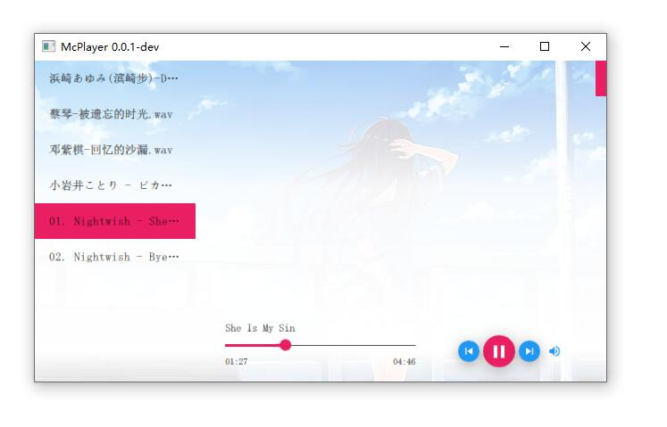

[](https://github.com/yuriyoung/mcplayer/stargazers)
[](https://github.com/yuriyoung/mcplayer/network)
[](https://github.com/yuriyoung/mcplayer/issues)
[](https://github.com/yuriyoung/mcplayer/blob/master/LICENSE)

# Introduction
a music playback player build on Qt 5 & Qt Quick 2.x & libvlc

# Features
- Local media playback control (play/pause/resume/stop/previous/next/shuffle)
- Read local media metadata (Title/Artist/Album/Genre...)
- Network media playback (TODO)
- Support playlist control
  - Playlist playback mode:
    - Item once
    - Item repeat
    - Sequential
    - Loop
    - Random
    - Heartbeat (TODO)
  - TODO: playlist save and load
- Audio volume control
- Audio visualization (TODO)
- Audio output format (TODO)
- Lyric (TODO)
- Media library (TODO)
- Support formats depend on libvlc

# ScreenShots



# Requirements
- Qt 5.12.0 or later
- Qt Quick 2.0 or later
- Libvlc 3.0 or later

# Build
- Download libvlc library (http://ftp.gnome.org/mirror/videolan.org/vlc/last/) Invalid
- Download libvlc library ([http://ftp.gnome.org/mirror/videolan.org/vlc/last/](https://download.videolan.org/pub/videolan/vlc/last/))

- Windows:
  - unzip if you download zip package, install if you download the execute package.
  
  - copy `lib` and `include` folder to `3rdparty/vlc/`.
    - declare `typedef __int64 ssize_t;` in `vlc.h` file if you compile on x64.
    - ~~change `#include <vlc/xxx.h>` to `#include <xxx.h>`(remove `vlc/`) if could not find header files.~~
  - copy dynamic link library (dll) files and `plugins` to `{project}/bin` path (the build path)
  
  	Folder tree like:
    ```
      mcplayer
    	|
    	+--bin
    	|  |
    	|   +--plugins
    	|   +--libvlc.dll
    	|   +--libvlccore.dll
    	|   +--mcplayer.exe
    	|
    	+--src
    	+--mcplayer.pro
    ```
  - open the `mcplayer.pro` with Qt Creator
  
  - build and run

- Mac:
  > TODO

- Linux:
  > TODO

# How to
- **How to add media file?**

  Drag and Drop Media files to the main window. click the `play` button.

## 
> Copyright &copy; Yuri Young yuri.young@qq.ocm

<details>
<summary>:small_red_triangle_down: :small_red_triangle_down: :small_red_triangle_down:</summary>

</details>

