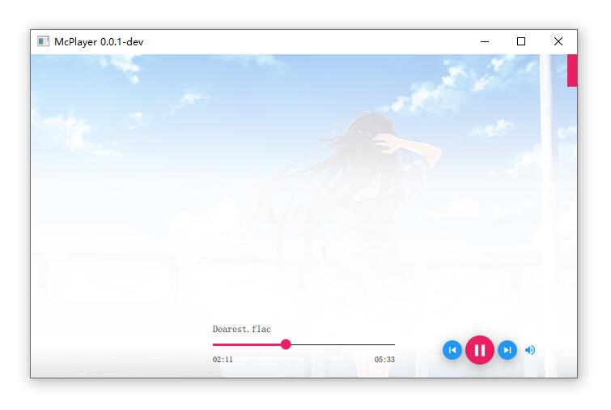

# Introduce
a music playback player build on Qt 5 & Qt Quick 2.x & libvlc


# ScreenShots



# Requirements
- Qt 5.12.0 or later
- Qt Quick 2.0 or later
- Libvlc 3.0 or later

# Build
- Download libvlc library (http://ftp.gnome.org/mirror/videolan.org/vlc/last/)

- Windows:
  - unzip if you download zip package, install if you download the execute package.
  
  - copy `lib` and `include` folder to `3rdparty/vlc/`.
  
  - copy dynamic link library (dll) files and `plugins` to `{project}/bin` path (the build path)
  
  	Folder tree like:
    ```
      mcplayer
    	|
    	+--bin
    	|  |
    	|   +--plugins
    	|   +--libvlc.dll
    	|   +--libvlccore.dll
    	|   +--mcplayer.exe
    	|
    	+--src
    	+--mcplayer.pro
    ```
  - open the `mcplayer.pro` with Qt Creator
  
  - build and run

- Mac:
  > TODO

- Linux:
  > TODO

> :warning: NOTE: Read the code ( `QmlWindow.h` and `QmlWindow.cpp` ) and do something yourself before build. :grin::grin::grin:

> Copyright &copy; Yuri Young yuri.young@qq.ocm
